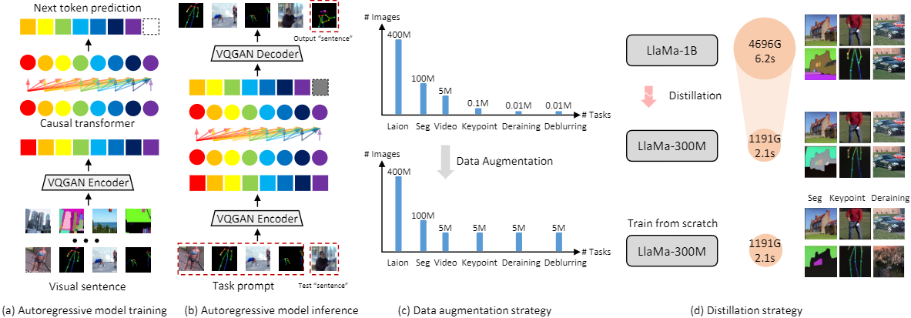

## Implementation of  "[Data-efficient Large Vision Models through Sequential Autoregression](https://arxiv.org/pdf/2402.04841.pdf)".


<p align="center">
  
</p>
<p align="center">
</p>
Training general-purpose vision models on purely sequential visual data, eschewing linguistic inputs, has heralded a new frontier in visual understanding. These models are intended to not only comprehend but also seamlessly transit to out-of-domain tasks.
However, current endeavors are hamstrung by an over-reliance on colossal models, exemplified by models with upwards of 3B parameters, and the necessity for an extensive corpus of visual data, often comprising a staggering 400B tokens. 
In this paper, we delve into the development of an efficient, autoregression-based vision model, innovatively architected to operate on a limited dataset. We meticulously demonstrate how this model achieves proficiency in a spectrum of visual tasks spanning both high-level and low-level semantic understanding during the testing phase. Our empirical evaluations underscore the model's agility in adapting to various tasks, heralding a significant reduction in the parameter footprint, and a marked decrease in training data requirements, thereby paving the way for more sustainable and accessible advancements in the field of generalist vision models.

#### TODO List
- [X] Code about training models.
- [X] Code about inferencing models.
- [ ] Huggingface & InternLM ckpts.
- [ ] Code about data generation.


#### Set up
```
based on InternLM-v0.2.1dev20231121
```


Install: `https://github.com/InternLM/InternLM/blob/v0.2.1dev20231121/doc/en/install.md`

Put your training data to `/path/to/data/vision`.

Training command:
`torchrun --nproc_per_node 8 train.py --config ./configs/pretrain_300m.py --launcher torch`

Training via KD command:
`torchrun --nproc_per_node 8 train.py --config ./configs/kd_1b_to_300m.py --launcher torch`

Convert model and inference example: `./tools`

The corresponding huggingface ckpt can be downloaded at [LLaMA_1b_hf Baidu Disk](https://pan.baidu.com/s/12oI_TOVHtbhriM1Bu1TXmw?pwd=1234) [LLaMA_300m_hf](https://github.com/ggjy/DeLVM/releases/download/hf-ckpt/llama_300m_hf.zip).


### Citation

If you find this project useful in your research, please consider cite:

```bibtex
@article{guo2024dataefficient,
  title={Data-efficient Large Vision Models through Sequential Autoregression},
  author={Guo, Jianyuan and Hao, Zhiwei and Wang, Chengcheng and Tang, Yehui and Wu, Han and Hu, Han and Han, Kai and Xu, Chang},
  journal={arXiv preprint arXiv:2402.04841},
  year={2024}
}
```

### Acknowledgement

We maily follow the directon of  project  [LVM](https://github.com/ytongbai/LVM). And this repo is based on [InternLM](https://github.com/InternLM/InternLM),  [huggingface.co/transformers](https://github.com/huggingface/transformers), and [huggingface.co/openMUSE](https://github.com/huggingface/open-muse).

### License

[](https://opensource.org/licenses/MIT)
